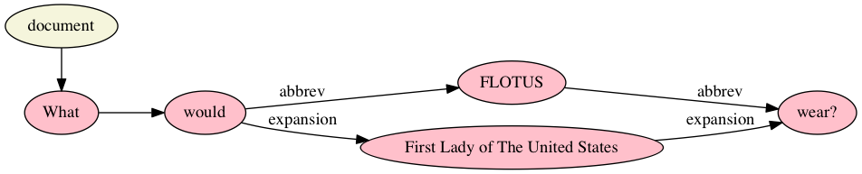
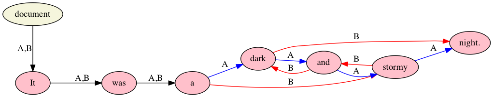

% Text as Graph: It’s more than just overlap!
% Ronald Haentjens Dekker and David J. Birnbaum
% Balisage: The Markup Conference, August 2017

____

# Text is multidimensional

<!-- <style>
img { width:100%; height:auto; }
</style>
-->


<!--
I propose that text, in essence, could be seen as this [show 3D visualization] 
-->

____

# Goal

* Academic Research and Development project
* New model for textual data containing
  generic markup
* Able to deal with many textual phenomena 
* Suitable for (focus on) mixed content
* Multiple layers of annotation 
* Either manual or machine assisted
* Separation of model and application layer

____


# Textual phenomena I

* Overlap (multiple hierarchies) 
* Discontinuity

More to come...


____

# Overlap (multiple hierarchies)
 
Percy Bysshe Shelley, “Ozymandias”

> Who said — **“Two vast and trunkless legs of stone  
Stand in the desart....** Near them, on the sand

```xml
<line>
	<phrase>Who said —</phrase>
	<phrase>“Two vast and trunkless legs of stone
</line>
<line>
	Stand in the desart….</phrase>
	<phrase>Near them,</phrase>
	<phrase>on the sand</phrase>
</line>
```
____

# Multiple hierarchies: projecting two trees over the same text nodes


____


# Discontinuity in XML

Lewis Carroll, *Alice in Wonderland*

> Alice was beginning to get very tired of sitting by her sister on the bank, and of having nothing to do: once or twice she had peeped into the book her sister was reading, but it had no pictures or conversations in it, **“and what is the use of a book,”** thought Alice **“without pictures or conversation?”**
 
```xml
<p>Alice was beginning to get very tired of sitting by her sister 
on the bank, and of having nothing to do: once or twice she had 
peeped into the book her sister was reading, but it had no pictures 
or conversations in it, <q>and what is the use of a book,</q> 
thought Alice <q>without pictures or conversation?</q></p>
``` 

<!--
Any XML processor knows that XML start and end tags go together. In TEI attributes needs to added to indicate that the two go together. The application needs to deal with this difference.
-->
____

# Model: Text as Graph

## Terminology

* **Text:** comparable to XML text nodes (Document node is there to know where to begin)
* **Markup:** comparable to XML elements
* **Annotation:** comparable to XML attributes, except that 1) annotation text may have markup, and 2) annotations on annotations are permitted

## Components

TAG is a directed **hypergraph** model

* **Nodes** (Document, Text, Markup, Annotation)
* **Edges** (one-to-one; textual order)
* **Hyperedges** (one-to-many, many-to-one; markup and annotation)

Operations in TAG are operations on sets of nodes and edges

<!-- explain what a hypergraph is -->
<!-- there is a lot of accumulated knowledge about reasoning over and operation with sets -->
____

# TAG in 3D (Video is preferred here)


____

# Overlap (multiple hierarchies) in TAG

Percy Bysshe Shelley, “Ozymandias”

> Who said — **“Two vast and trunkless legs of stone  
Stand in the desart....** Near them, on the sand


<!-- ai the hierarchies are not really all that visible here, since the "dominate" relation is not used. Say something here about the difference between containment and dominance? -->

____

# Discontinuity in TAG

Lewis Carroll, *Alice in Wonderland*

Alice was beginning to get very tired of sitting by her sister on the bank, and of having nothing to do: once or twice she had peeped into the book her sister was reading, but it had no pictures or conversations in it, “and what is the use of a book,” thought Alice “without pictures or conversation?”


____

# Textual phenomena II

* White space as crypto-overlap
* Datatyping and artifactual hierarchy
* Main-text content and annotation content
* Scope of reference

# White space as crypto-overlap

Percy Bysshe Shelley, “Ozymandias”

> Who said two vast and trunkless legs of stone
 
```xml
<line>
	<foot>Who said</foot>
	<foot>two vast</foot>
	<foot>and trunk</foot><foot>less legs</foot>
	<foot>of stone</foot>
</line>
```
The following pseudo-XML is not well formed:

```xml
<foot><word>and</word> <word>trunk</foot><foot>less</word> <word>legs</word></foot>
```
<!-- element boundary in the middle of a word -->
<!-- if you tag the text for both feet and words you get overlap. It is implicit. We were letting the white space function as pseudo markup. Once we make it explicit we have overlap. -->

# Data typing causes artifactual hierarchy in XML

```xml
<title><name>Romeo</name> and <name>Juliet</name></title>
```


____

# Data typing in TAG


____


# White space as crypto-overlap in TAG


____

# Footnotes (scope of reference) in XML

> Textual content in TAG is expressed by nodes with a **type** value of “text”, each of which represents a segment of textual content (Text nodes may also be empty). The order of the text is stored as directed regular (one-to-one) edges between pairs of Text nodes; this chain begins at the Document node, which points to the first Text node, and a single, unbroken chain connects all Text nodes in the document except those in annotations.<sup>23</sup>

```xml
<p>Textual content in TAG is expressed by nodes with a **type** 
value of “text”, each of which represents a segment of textual 
content (Text nodes may also be empty). The order of the text is 
stored as directed regular (one-to-one) edges between pairs of Text 
nodes; this chain begins at the Document node, which points to the 
first Text node, and a single, unbroken chain connects all Text 
nodes in the document except those in annotations.<fn><p>[Footnote
content goes here.]</p></fn></p>
``` 
 
Is the footnote on the last sentence, the last two sentences, or the entire paragraph?

____

# Footnotes (scope of reference) in TAG


Scope of footnote is made clear by the hyperedge coming from the anonymous markup node. Plus content of footnote is not part of the content of the document. 


____

# Prototype implementation

* Alexandria Markup is a prototype implementation of TAG.
* Based on client/server architecture
* REST protocol
* Server is written in Java
* Clients available in Java and Python
* License; Open source; Apache license
* Able to import files encoded in LMNL Sawtooth syntax
* Able to import files encoded in TexMECS syntax
* Query language is in early stage of implementation
* Validation...
* TAG portal: http://github etc

____

# What is text really?

- (un)ordered
- (dis)continuous
- hierarchie(s)

# So what is text really?

## What text isn’t

* Not (always) ordered
* Not (always) hierarchical (not just not always monohierarchical, but sometimes not hierarchical at all)
* Not every XML element is a real Content Object

___

# Conclusion

TAG is a new text model that does not impose a hierarchy, but it allows one or more. It currently supports one order, but could be extended to allow unordered content or multiple orders. It thus addresses several textual phenomena that cannot be represented in other models without resorting to workarounds. As such it allows us to map and process textual phenomena in a natural and idiomatic way.


____


# Three things that are hard for XML and (currently) for TAG

* Simultaneity
* Transposition
* Intradocumentary variation

____

# Simultaneity



____

# Transposition



# Intradocumentary variation

____


 