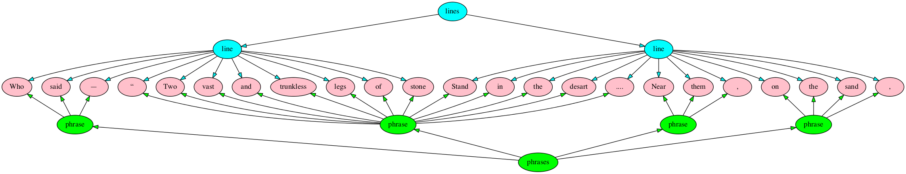
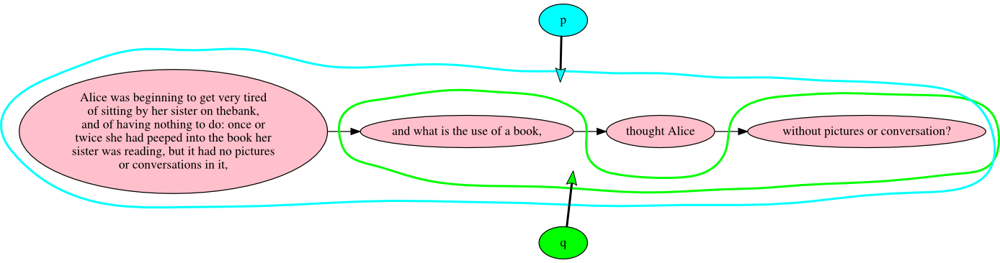
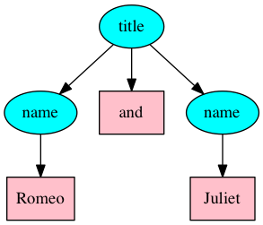
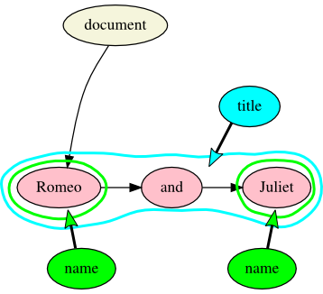
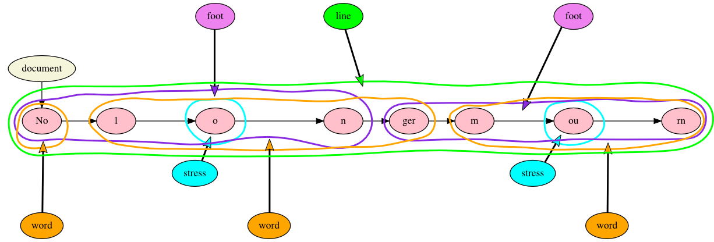

% Text as Graph: It’s more than just overlap!
% Ronald Haentjens Dekker and David J. Birnbaum
% Balisage: The Markup Conference, August 2017

# Outline

* What’s a model for
* How TAG works
* Five things that are hard for XML, but not for TAG
* Three things that are hard for XML and (currently) for TAG
* Conclusion 

# What’s a model for

* Parsing real XML start and end tags is automatic because they’re part of the model. No semantics required.
* Parsing Trojan milestones requires application semantics.
* “What text really is” belongs in the model, and not at the application layer.

# So what is text really?

## What text isn’t

* Not (always) ordered
* Not (always) hierarchical (not just not always monohierarchical, but sometimes not hierarchical at all)
* Not every XML element is a real Content Object

# How TAG works

## Terminology

* **Markup:** comparable to XML elements
* **Annotation:** comparable to XML attributes, except that 1) annotation text may have markup, and 2) annotations on annotations are permitted

## Components

TAG is a **hypergraph** model

* **Nodes** (Document, Text, Markup, Annotation)
* **Edges** (one-to-one; textual order)
* **Hyperedges** (one-to-many, many-to-one; markup and annotation)

Operations in TAG are operations on sets of nodes and edges

____

# Two types of challenges for XML (one shared with TAG)

## Modeling challenges

* If it isn’t in the model and requires a workaround, workarounds vary, which risks inconsistency in a corpus
* E.g.: In an overlap situation, which hierarchy is represented by container tags and which by milestones?

## Lexical challenges

* The same structural markup unit may have different name properties in different documents
* Inherently a matter of lexical semantics, which affects TAG as much as XML

____

# Five things that are hard for XML, but not for TAG

* Multiple hierarchies (overlap)
* Discontinuity
* Artifactual hierarchy
* White space as crypto-overlap
* Scope of reference

____

# Multiple hierarchies: overlap in XML

Percy Bysshe Shelley, “Ozymandias”

> Who said — **“Two vast and trunkless lets of stone  
Stand in the desart....** Near them, on the sand

```xml
<line>
	<phrase>Who said —</phrase>
	<phrase>“Two vast and trunkless legs of stone**
</line>
<line>
	Stand in the desart….</phrase>
	<phrase>Near them,</phrase>
	<phrase>on the sand</phrase>
</line>
```
____

# Multiple hierarchies: projecting two trees over the same text nodes



____

# Multiple hierarchies: overlap in TAG


____

# Discontinuity in XML

Lewis Carroll, *Alice in Wonderland*

> Alice was beginning to get very tired of sitting by her sister on the bank, and of having nothing to do: once or twice she had peeped into the book her sister was reading, but it had no pictures or conversations in it, **“and what is the use of a book,”** thought Alice **“without pictures or conversation?”**
 
```xml
<p>Alice was beginning to get very tired of sitting by her sister 
on the bank, and of having nothing to do: once or twice she had 
peeped into the book her sister was reading, but it had no pictures 
or conversations in it, <q>and what is the use of a book,</q> 
thought Alice <q>without pictures or conversation?</q></p>
``` 
____

# Discontinuity in TAG



____

# Artificial hierarchy in XML

```xml
<title><name>Romeo</name> and <name>Juliet</name></title>
```



____

# Artificial hierarchy in TAG



____

# White space as crypto-overlap in XML

Percy Bysshe Shelley, “Ozymandias”

> Who said two vast and trunkless legs of stone
 
```xml
<line>
	<foot>Who said</foot>
	<foot>two vast</foot>
	<foot>and trunk</foot><foot>less legs</foot>
	<foot>of stone</foot>
</line>
```
The following pseudo-XML is not well formed:

```xml
<foot><word>and</word> <word>trunk</foot><foot>less</word> <word>legs</word></foot>
```

# White space as crypto-overlap in TAG


____

# Scope of reference in XML

> Textual content in TAG is expressed by nodes with a **type** value of “text”, each of which represents a segment of textual content (Text nodes may also be empty). The order of the text is stored as directed regular (one-to-one) edges between pairs of Text nodes; this chain begins at the Document node, which points to the first Text node, and a single, unbroken chain connects all Text nodes in the document except those in annotations.<sup>23</sup>

```xml
<p>Textual content in TAG is expressed by nodes with a **type** 
value of “text”, each of which represents a segment of textual 
content (Text nodes may also be empty). The order of the text is 
stored as directed regular (one-to-one) edges between pairs of Text 
nodes; this chain begins at the Document node, which points to the 
first Text node, and a single, unbroken chain connects all Text 
nodes in the document except those in annotations.<fn><p>[Footnote
content goes here.]</p></fn></p>
``` 
 
Is the footnote on the last sentence, the last two sentences, or the entire paragraph?

# Scope of reference in TAG

# Three things that are hard for XML and (currently) for TAG

* Simultaneity
* Transposition
* Intratextual variation

____

# Simultaneity

____

# Transposition

____


# Intratextual variation

____

# Conclusions

Thank you!

* TAG (Text As Graph) is the data model  
* Alexandria is a text repository and graph database for text
* TAG and Alexandria portal: <https://github.com/HuygensING/TAG>
